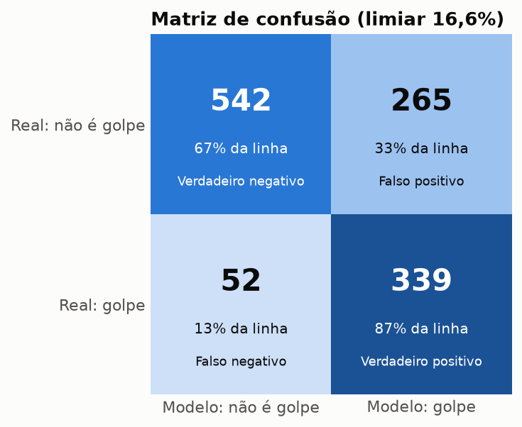
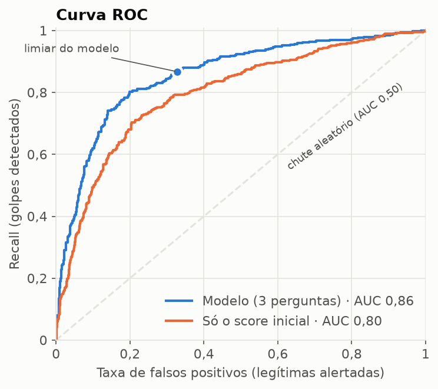
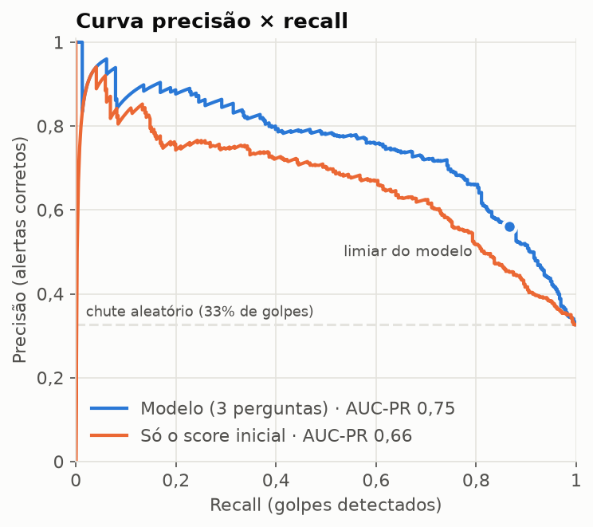
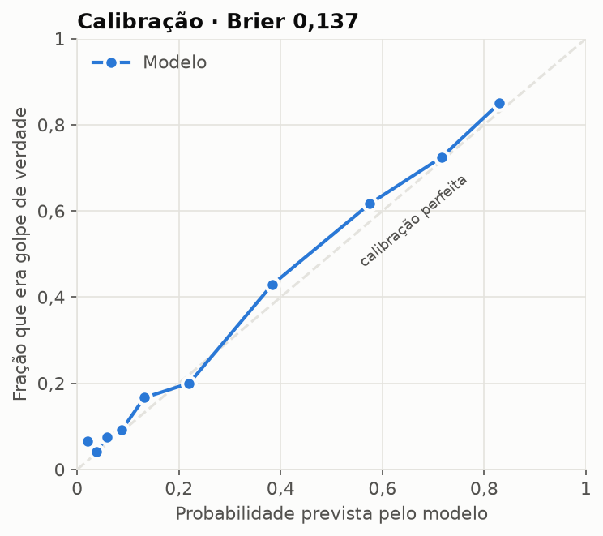
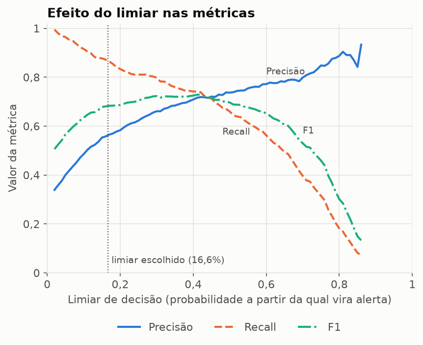
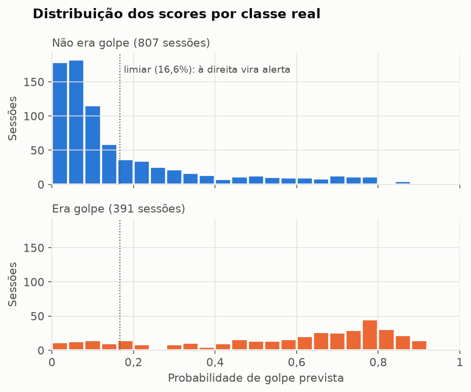

# Relatório de métricas do classificador

Gerado por `python -m triagem.relatorio`. Modelo `regressao_logistica`, versão `20260927115952`, **3 perguntas por sessão**.
Conjunto de teste: 1198 sessões (391 golpes, 32,6%), sem as sessões de coação física.
As métricas usam a probabilidade calibrada sem teto/piso, que é a usada nas decisões da API.

## De onde vêm esses números

Não há base pública de transações Pix com desfecho real, então as sessões foram **simuladas** por `triagem/gerador_dataset.py` (12.000 sessões):

1. **Situação escondida:** o gerador sorteia se a sessão é legítima (~66%) ou um tipo de golpe (falsa central, WhatsApp clonado, venda falsa, mão fantasma etc.).
2. **Dados da transação:** valor, horário, chave e dispositivo são gerados de acordo com essa situação. Um golpe, por exemplo, tende a ter valor alto e redondo e chave recém-criada.
3. **Perguntas e respostas:** as 3 perguntas são escolhidas pelo mesmo seletor da API, e as respostas são sorteadas conforme a situação. Numa sessão de mão fantasma, "instalei um app que me pediram" é bem mais provável; numa legítima, predominam respostas tranquilas.
4. **Gabarito:** cada sessão recebe o rótulo golpe / não é golpe por uma fórmula que combina o score inicial, as respostas e um ruído aleatório.

As sessões foram divididas em 80% treino, 10% validação e 10% teste. O modelo aprendeu só com o treino. Para cada uma das 1198 sessões de teste (sem as de coação física), ele recebe os dados da transação e as respostas, **sem ver o gabarito**, e devolve uma probabilidade. Se ela for de pelo menos 16,6%, a sessão conta como alerta. Comparando com o gabarito:

| | Era golpe | Não era golpe |
|---|---|---|
| **Modelo alertou** | VP = 339 | FP = 265 |
| **Modelo não alertou** | FN = 52 | VN = 542 |

A matriz soma 1198 e não 12.000 porque só usa o teste: avaliar com sessões que o modelo já viu no treino daria números otimistas demais. Todas as outras métricas saem dessas quatro contagens (por exemplo, recall = VP / (VP + FN)). A exceção são AUC, Brier e calibração, que usam a probabilidade diretamente.

> **Limitação:** como o gabarito vem de uma fórmula escrita por nós, as métricas medem o quanto o modelo reaprende essa fórmula a partir das respostas, **não** o quanto ele acertaria com golpes reais. Para isso é preciso comparar com desfechos reais confirmados; o log da API em SQLite já guarda as sessões no mesmo formato para quando esses dados existirem.

## Métricas

| Métrica | Limiar do modelo (16,6%) | Limiar 50% |
|---|---|---|
| Acurácia | **73,5%** | 81,2% |
| Precisão | **56,1%** | 73,7% |
| Recall (sensibilidade) | **86,7%** | 66,0% |
| Especificidade | **67,2%** | 88,6% |
| F1-score | **68,1%** | 69,6% |
| Acurácia balanceada | **76,9%** | 77,3% |
| AUC-ROC | **0,856** (score inicial sozinho: 0,797) | — |
| AUC-PR | **0,750** (score inicial sozinho: 0,661) | — |
| Brier score | **0,137** (chute: 0,220) | — |
| Log loss | 0,434 | — |

## Matriz de confusão (limiar 16,6%)

| | Modelo: não é golpe | Modelo: golpe |
|---|---|---|
| **Real: não é golpe** | 542 (verdadeiro negativo) | 265 (falso positivo) |
| **Real: golpe** | 52 (falso negativo) | 339 (verdadeiro positivo) |

## Como interpretar

**A matriz de confusão** cruza o que o modelo disse com o que era verdade. Das 391 transações de golpe do teste, o modelo alertou 339 (**verdadeiros positivos**) e deixou passar 52 (**falsos negativos**, o erro mais caro). Das 807 legítimas, liberou 542 sem alerta (**verdadeiros negativos**) e alertou 265 à toa (**falsos positivos**, que custam um incômodo ao cliente).

- **Acurácia (73,5%)**: quantas decisões o modelo acertou, no total. Parece a métrica mais natural, mas engana quando as classes são desbalanceadas: como só 32,6% das sessões são golpe, um "modelo" que respondesse sempre "não é golpe" teria 67,4% de acurácia sem detectar nenhum golpe. Por isso ela não é a métrica principal aqui.
- **Recall ou sensibilidade (86,7%)**: dos golpes reais, quantos o modelo pegou. Aqui, **de cada 100 golpes, ~87 são alertados**. É a métrica prioritária, porque um golpe que passa vira dinheiro perdido e, no Pix, difícil de recuperar.
- **Precisão (56,1%)**: dos alertas que o modelo deu, quantos eram golpe mesmo. Aqui, **de cada 10 alertas, ~6 são golpe**; os outros são falsos alarmes. Com 604 alertas no teste, 265 foram em transações legítimas.
- **Especificidade (67,2%)**: das transações legítimas, quantas passaram sem alerta. É o "recall" do lado das legítimas.
- **F1-score (68,1%)**: um único número que combina precisão e recall (média harmônica). Só fica alto se os dois forem altos; serve para comparar modelos ou limiares.
- **Acurácia balanceada (76,9%)**: média entre recall e especificidade. Diferente da acurácia comum, não é inflada pela classe majoritária.
- **AUC-ROC (0,856)**: não depende de limiar. É a chance de um golpe sorteado receber um score maior que uma transação legítima sorteada. 0,5 é chute; 1,0 é perfeito. O score inicial sozinho dá 0,797: **as 3 perguntas melhoram a separação**.
- **AUC-PR (0,750)**: resume a curva precisão × recall. A referência de um chute é a proporção de golpes (0,326); quanto mais acima, melhor.
- **Brier score (0,137)**: erro médio da probabilidade (0 é perfeito). Um modelo que sempre dissesse "32,6% de chance" teria 0,220. Importa porque a probabilidade é guardada na base e devolvida pela API (`score_refinado`); o MVP não a mostra ao cliente, mas outro sistema pode usá-la.
- **Calibração**: se o modelo diz 70%, cerca de 70% desses casos deveriam ser golpe. No gráfico, quanto mais perto da diagonal, mais confiável é a probabilidade devolvida pela API.

**Por que o limiar é 16,6% e não 50%?** O limiar é a probabilidade a partir da qual a transação vira alerta: acima dele, o chat mostra a mensagem "Você não gostaria de repensar sobre essa transação por alguns minutos?"; abaixo, "Não encontramos sinais fortes de golpe". Ele foi escolhido no conjunto de validação como o maior que ainda detecta pelo menos 90% dos golpes; no teste, com dados que o modelo nunca viu, o recall ficou em 86,7%, uma variação normal entre amostras. Abaixá-lo aumenta o recall e derruba a precisão; subi-lo faz o contrário (veja o gráfico do limiar e a coluna "Limiar 50%" da tabela). Como a transferência nunca é bloqueada, só há um convite a repensar, um falso alarme custa pouco e um golpe não detectado custa muito, então o limiar favorece o recall.

## Curvas

**ROC**: cada ponto é um limiar possível. Quanto mais a curva encosta no canto superior esquerdo, melhor. A curva laranja mostra o que o score inicial conseguiria sozinho, sem as perguntas.

**Precisão × recall**: mostra a troca entre detectar mais golpes (direita) e dar menos alarmes falsos (alto). É a curva mais honesta quando os golpes são minoria.

**Calibração**: as probabilidades foram agrupadas em 10 faixas; cada ponto compara a média prevista com a fração real de golpes na faixa.

**Efeito do limiar**: como precisão, recall e F1 mudam conforme o limiar sobe. A linha pontilhada é o limiar em uso.

**Distribuição dos scores**: quanto menos as duas cores se sobrepõem, melhor o modelo separa golpe de não-golpe. O que fica à direita do limiar vira alerta.

## Níveis de risco (uso interno)

A API classifica cada sessão como baixo (abaixo do limiar), moderado (entre o limiar e 50%) ou alto (50% ou mais). O cliente não vê o nível nem o número: moderado e alto recebem a mensagem de "repensar"; baixo recebe "Não encontramos sinais fortes de golpe". A tabela mostra quantos eram golpe de verdade em cada nível:

| Nível de risco | Sessões | Quantas eram golpe de verdade |
|---|---|---|
| baixo | 594 | 8,8% |
| moderado | 254 | 31,9% |
| alto | 350 | 73,7% |
